[](https://opensource.org/licenses/MIT)

# ReactQuest: Frontend Machine Coding Challenges

Welcome to **ReactQuest**, a comprehensive collection of frontend machine coding challenges. This project is a personal archive of my journey mastering React, featuring production-ready solutions to common interview problems.

Visit the live demo: [ReactQuest Website](https://my-react-practice-theta.vercel.app/)

## 🌟 Key Features

- **Dynamic Challenge Loader**: A custom-built registry system that automatically discovers and loads challenges from the file system.
- **Interactive Solutions**: Fully functional implementations of common UI patterns.
- **Documentation**: Each challenge includes a problem statement and requirements, rendered from Markdown.
- **Modern Stack**: Built with the latest ecosystem tools.

## 🏗️ Architecture

This project uses a file-system-based routing approach for challenges. Adding a new challenge is as simple as creating a folder.

```mermaid
graph TD
    subgraph FileSystem ["📂 File System (src/challenges)"]
        Dir[Challenge Directory]
        Index["index.tsx (Component)"]
        Info["info.ts (Metadata)"]
        Readme["README.md (Docs)"]
        
        Dir --> Index
        Dir --> Info
        Dir --> Readme
    end

    subgraph Core ["⚙️ Core System"]
        Glob["import.meta.glob"]
        Registry["challenge-registry.ts"]
    end

    subgraph UI ["🖥️ Application UI"]
        List["Challenges List Page"]
        Wrapper["Challenge Layout"]
        Renderer["Markdown Renderer"]
    end

    Index & Info & Readme --> Glob
    Glob --> Registry
    Registry -->|List Config| List
    Registry -->|Lazy Component| Wrapper
    Registry -->|Docs Content| Renderer
```



## 📚 Challenge Collection

| Challenge | Difficulty | Links | Description |
|-----------|------------|-------|-------------|
| **Counter** | 🟢 Easy | [Live Demo](https://my-react-practice-theta.vercel.app/challenges/counter) • [Source](./src/challenges/counter) | A simple counter with increment, decrement, and reset capabilities. |
| **Even or Odd** | 🟢 Easy | [Live Demo](https://my-react-practice-theta.vercel.app/challenges/even-or-odd) • [Source](./src/challenges/even-or-odd) | Number parity checker with simulated async loading states. |
| **Chips Input** | 🟢 Easy | [Live Demo](https://my-react-practice-theta.vercel.app/challenges/chips-input) • [Source](./src/challenges/chips-input) | Tag input component with creation and deletion features. |
| **Asterisk Validation** | 🟢 Easy | [Live Demo](https://my-react-practice-theta.vercel.app/challenges/asterisk-field-validation) • [Source](./src/challenges/asterisk-field-validation) | Form validation pattern for required fields. |
| **FAQ Accordion** | 🟢 Easy | [Live Demo](https://my-react-practice-theta.vercel.app/challenges/frequently-asked-questions) • [Source](./src/challenges/frequently-asked-questions) | Expandable/collapsible accordion component. |
| **Countdown Timer** | 🟡 Medium | [Live Demo](https://my-react-practice-theta.vercel.app/challenges/countdown-timer) • [Source](./src/challenges/countdown-timer) | Fully functional timer with pause/resume and notification support. |

## 💻 Tech Stack

- **Framework**: React 19 + Vite
- **Language**: TypeScript
- **Styling**: Tailwind CSS v4
- **Routing**: React Router v7
- **Icons**: Lucide React
- **Markdown**: React Markdown

## 📂 Project Structure

```
my-react-practice/
├── src/
│   ├── challenges/           # Self-contained challenge modules
│   │   ├── counter/
│   │   │   ├── index.tsx     # Solution Component
│   │   │   ├── info.ts       # Metadata configuration
│   │   │   └── README.md     # Problem description
│   │   └── ...
│   ├── utils/
│   │   └── challenge-registry.ts # Dynamic loader logic
│   ├── layout/
│   │   └── ChallengeLayout.tsx   # Standardized wrapper
│   └── ...
```

## 🛠️ Getting Started

Follow these steps to run the project locally.

1. **Clone the repository**
   ```bash
   git clone https://github.com/ijas9118/my-react-practice.git
   cd my-react-practice
   ```

2. **Install dependencies**
   ```bash
   pnpm install
   ```

3. **Start development server**
   ```bash
   pnpm dev
   ```

4. **Build for production**
   ```bash
   pnpm build
   ```

## 📄 License

This project is licensed under the MIT License.

---
*Created by [Ijas](https://github.com/ijas9118) as a personal learning initiative.*
